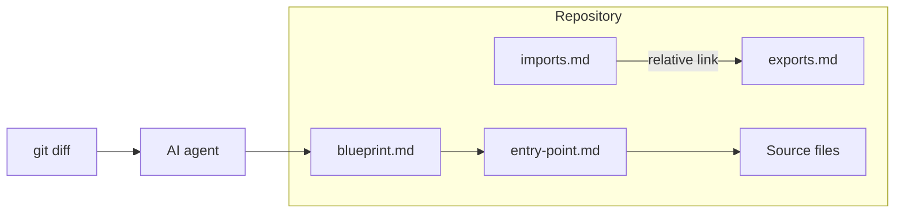
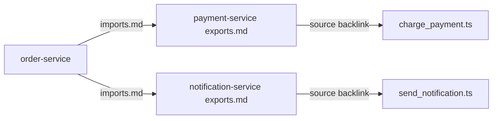

# Blueprint Pattern for Architects

**How to document software architecture that humans and AI agents can traverse deterministically.**

The Blueprint Pattern is not another documentation tool. It is a **pattern** for co-locating architectural knowledge with source code — structured as a Markdown link graph, maintained by AI agents, versioned in Git, and aligned with arc42 and the C4 Model.

This article explains the method for software architects: the problem it solves, the principles behind it, the workflow you operate, and where the boundaries are.

---

## Table of contents

1. [Why architecture breaks down for AI agents](#1-why-architecture-breaks-down-for-ai-agents)
2. [The Blueprint Pattern](#2-the-blueprint-pattern)
3. [Seven principles for architects](#3-seven-principles-for-architects)
4. [The method step by step](#4-the-method-step-by-step)
5. [Roles and responsibilities](#5-roles-and-responsibilities)
6. [Cross-application dependencies](#6-cross-application-dependencies)
7. [Comparison with related approaches](#7-comparison-with-related-approaches)
8. [Design constraints and honest limits](#8-design-constraints-and-honest-limits)
9. [Getting started](#9-getting-started)

---

## 1. Why architecture breaks down for AI agents

Modern AI coding agents — Cursor, Claude Code, GitHub Copilot — are effective inside a single file. They struggle with architecture.

Ask an agent *"how does the payment service connect to the notification system?"* and one of two things happens:

1. It **hallucinates** a plausible but wrong answer, or
2. It **scans raw source files** until your context window is exhausted.

The knowledge exists. It lives in a senior engineer's head, in a Confluence page last updated eighteen months ago, or in a Lucidchart diagram nobody maintains. None of these forms are **traversable** by an agent at query time.

### What existing approaches miss

| Approach | What it solves | What it doesn't |
|---|---|---|
| Classic RAG (Chroma, Pinecone…) | Makes large corpora searchable | Non-deterministic; needs embedding infrastructure; stale on every refactor |
| GraphRAG (Microsoft) | Structured retrieval | Requires graph database + LLM pipeline; expensive rebuild on change |
| Wiki / Confluence | Human-readable documentation | Manually maintained; decoupled from code; outdated within weeks |
| Docusaurus / MkDocs | Rendered documentation sites | Static; no agent-native traversal; no interface contracts |
| JSDoc / Javadoc | API-level documentation | API surface only; no architectural decisions; no cross-app dependencies |

As an architect, you already know the failure mode: documentation decays because updating it is nobody's job in the sprint. AI agents amplify the problem — they consume stale docs confidently.

The Blueprint Pattern addresses both sides: **documentation that stays current** (because it lives in the repo and updates on `git diff`) and **documentation that agents can navigate reliably** (because navigation is graph traversal, not similarity search).

---

## 2. The Blueprint Pattern

### Core insight

Large language models are excellent at reading and writing structured Markdown. Instead of retrieving architecture knowledge at query time through embeddings, Blueprint Pattern **compiles it once** into an explicit link graph — and keeps it current through incremental maintenance.



### Repository structure

Every application using the Blueprint Pattern adds a `docs/architecture/` directory:

```
my-app/
├── docs/architecture/
│   ├── blueprint.md       ← persistent work file across sessions
│   ├── entry-point.md             ← arc42 / C4 overview of this application
│   ├── work/                      ← Architecture Work (questions, analyses, designs)
│   ├── interfaces/
│   │   ├── exports.md             ← APIs, events, services (unique IDs)
│   │   └── imports.md             ← relative links to partner exports.md
│   └── arc42/
│       ├── introduction.md
│       ├── context.md
│       ├── building-blocks.md     ← Mermaid diagrams + backlinks to source
│       ├── runtime.md
│       ├── deployment.md
│       ├── decisions/             ← Architecture Decision Records
│       └── …                      ← all 12 arc42 sections
```

Every file is plain Markdown. Every link is a relative path to another Markdown file or a source file. No build step. No external service. No vendor lock-in.

### What changes for architects

You stop treating architecture documentation as a separate deliverable that rots in a wiki. Instead, you define a **structure** (arc42 + interface contracts), a **progress tracker** (Blueprint), and a **maintenance trigger** (`git diff`). The AI agent becomes the scribe; you remain the reviewer and decision-maker.

See the [sample application](../examples/sample-app/) for a complete working example with three services.

---

## 3. Seven principles for architects

### 1. Deterministic retrieval

Navigation happens exclusively via explicit Markdown links — graph traversal, not similarity search. An agent following a link either arrives at a file or it does not. There is no probability score, no hallucinated chunk, no retrieval drift.

Every architectural claim is traceable to a concrete file and line number. For architects, this means auditability: you can verify what the agent told you.

### 2. Documentation as code

The architecture graph lives **inside the repository**, co-located with the source it describes. A pull request that changes behavior also changes the documentation. Code review, Git history, and branch workflows apply to architecture knowledge exactly as they apply to code.

This is the same "docs as code" principle you may already advocate — The Blueprint Pattern makes it agent-operational.

### 3. AI-maintained lifecycle

The Blueprint Pattern defines these operations:

| Operation | Trigger | Outcome |
|-----------|---------|---------|
| **Bootstrap** | No Blueprint exists | Agent creates Blueprint, works through arc42 phases |
| **Refinement** | Architect request | Targeted deepening of specific sections |
| **Maintenance** | Meaningful `git diff` | Update only affected files; idempotent |
| **Architecture Work** | Question, analysis, or design request | Traverses graph; writes to `work/` |
| **Review** | After generation (fresh session) | Verifies docs against source; reports to `work/` |

**Extensions** (base context, specialized roles, compaction, ops layer) are documented in [Blueprint Pattern Extensions](../blueprint-pattern-extensions.md).

Bootstrap is a one-time investment spread across multiple agent sessions. Maintenance is the ongoing cost — typically minutes per pull request, not hours of manual wiki editing.

**Architecture Work** uses the compiled graph to answer questions, run analyses, and draft designs — without rescanning the whole codebase. Results live in `docs/architecture/work/` and are registered in the Blueprint. See the [Architecture Work Guide](../architecture-work-guide.md) and [PROMPT.md](../../PROMPT.md#4-architecture-work-prompts).

### 4. Cross-session continuity via Blueprint

`blueprint.md` is the persistent work file. It tracks every documentation phase across conversation boundaries:

| Phase | arc42 section | Target file | State | Last updated |
|-------|---------------|-------------|-------|--------------|
| 1 | Introduction and Goals | arc42/introduction.md | [x] done | 2026-05-01 |
| 2 | Constraints | arc42/constraints.md | [x] done | 2026-05-02 |
| 3 | Context and Scope | arc42/context.md | [~] in progress | 2026-05-10 |
| 4 | Solution Strategy | arc42/solution-strategy.md | [ ] open | — |

States: `[ ]` open · `[~]` in progress · `[x]` done · `[!]` blocked

A new agent session reads the Blueprint, resumes from the next open phase, and updates the Blueprint before stopping. Think of it as an **architecture backlog** that survives context window limits.

### 5. Interface contracts

Every application in your ecosystem maintains two interface files:

- **`exports.md`** — what this app provides: APIs, events, services, each with a unique ID
- **`imports.md`** — what this app consumes, as relative Markdown links to partner `exports.md` files

Cross-application dependencies become explicit, navigable, and version-controlled. An agent can trace from a consumer to a provider by following links — no external dependency graph tool required.



### 6. Architecture guardrails

While documenting, the agent detects and surfaces:

- Applied design patterns (GoF, enterprise integration patterns)
- Structural smells (Fowler's code smells, coupling, cyclic dependencies)
- SOLID violations at module boundaries
- Style deviations → recorded as ADRs

Findings appear inline under `### ⚠ Architecture notes` and are summarized in the Blueprint under `## Guardrail findings`. For architects, this turns documentation sessions into lightweight architecture reviews.

### 7. Referential integrity

Before any output, the agent verifies that all Markdown backlinks resolve to existing paths. Broken links are surfaced explicitly — never silently omitted. On `git diff` updates, renamed or deleted files trigger path corrections across referencing files.

Mechanical enforcement via CI (Markdown link checker) catches what agents miss. This repository includes a ready-to-use workflow at [`.github/workflows/blueprint-pattern-integrity.yml`](../../.github/workflows/blueprint-pattern-integrity.yml).

---

## 4. The method step by step

### Phase A: Bootstrap (once)

**Goal:** Create the full `docs/architecture/` structure and populate initial arc42 sections.

**Prerequisites:**

1. Copy the [system prompt](../../PROMPT.md#1-system-prompt) into your AI assistant:
   - Cursor → `.cursor/rules/blueprint-pattern.mdc`
   - Claude Code → `CLAUDE.md`
   - GitHub Copilot → `.github/copilot-instructions.md`

2. Ensure the application is in scope (single app; cross-app links go to partner `exports.md` only).

**Steps:**

1. Prompt: *"Bootstrap Blueprint Pattern documentation for this application"*
2. The agent analyzes the file tree and creates `blueprint.md` with all phases marked `[ ]`
3. The agent marks Bootstrap `[x]` and begins Phase 1 (Introduction and Goals)
4. After each arc42 section, the agent updates Blueprint state and session log
5. Stop when context is exhausted; resume in the next session

**Architect actions during Bootstrap:**

- Review generated arc42 sections for accuracy — the agent reads code, but you validate intent
- Challenge guardrail findings; promote significant ones to ADRs
- Verify interface contracts match your integration landscape

**Typical duration:** 3–8 agent sessions for a mid-sized application, depending on codebase complexity and review thoroughness.

### Phase B: Refinement (on demand)

**Goal:** Deepen specific sections without re-running Bootstrap.

**Example prompts:**

- *"Extend Blueprint Pattern documentation by focusing on event sourcing patterns in the order module."*
- *"Update arc42/runtime.md with the retry and circuit-breaker behavior in payment processing."*
- *"Add an ADR for the decision to use async messaging instead of synchronous REST between order and notification."*

Refinement is how architects **steer** the documentation toward what matters — quality attributes, integration patterns, decision rationale.

On **large, core enterprise systems**, Refinement is not optional polish after Bootstrap — it is the ongoing mode of operation. The graph stays accurate and deep only when architects and agents return regularly to extend arc42 sections, interface contracts, and work items as the system evolves.

### Phase C: Maintenance (ongoing)

**Goal:** Keep documentation current as code changes.

**Trigger:** Meaningful `git diff` — new endpoints, renamed modules, changed event schemas, removed services.

**Steps:**

1. After code changes (or in the same PR), prompt: *"Run Blueprint Pattern maintenance on the current git diff"*
2. The agent identifies architecturally relevant changes
3. Updates affected Markdown files, interface contracts, and Blueprint
4. Runs referential integrity check

**Integration into your workflow:**

Add to your PR checklist:

- [ ] Code change has architectural impact?
- [ ] If yes: Blueprint Pattern maintenance run and docs updated in this PR
- [ ] CI link check passes

Maintenance is **idempotent** — running it twice on the same diff produces the same result. No full rebuild.

### Phase D: Ecosystem documentation (multi-app)

**Goal:** Connect applications through interface contracts.

Each application maintains its own `docs/architecture/`. Cross-app dependencies are expressed only in `imports.md` as links to partner `exports.md` files — never duplicated prose.

For programmatic access, an MCP server can expose:

- **`get_ecosystem_map`** — full graph from `ecosystem-index.md`
- **`trace_dependency`** — follow import/export chains across boundaries
- **`get_component_with_code`** — resolve architecture doc to source file

MCP integration is optional; the Markdown graph works without it.

### Phase E: Architecture Work (query, analysis, design)

**Goal:** Use the compiled graph to answer architecture questions, run analyses, and produce designs — with traceable, reviewable Markdown outputs.

**Prerequisite:** Bootstrap complete enough to traverse (`entry-point.md`, relevant arc42 sections, interfaces).

**Folder:** `docs/architecture/work/YYYY-MM-DD-<slug>.md` — one file per work item, registered in `blueprint.md` as `WRK-NNN`.

| Mode | Prompt intent | Output type |
|------|---------------|-------------|
| **Query** | Answer a specific question | `question` |
| **Analysis** | Evaluate risks, coupling, quality | `analysis` |
| **Design** | Propose target architecture | `design` (+ optional ADR draft) |

**Example prompts** (full text in [PROMPT.md](../../PROMPT.md#4-architecture-work-prompts)):

- *"Blueprint Pattern — Architecture Work (query). Question: How does order-service connect to payment-service?"*
- *"Blueprint Pattern — Architecture Work (analysis). Topic: payment resilience. Scope: order-service, payment-service."*
- *"Blueprint Pattern — Architecture Work (design). Goal: circuit breaker on payment client."*

**Rules:**

1. Traverse the Markdown graph from `blueprint.md` and `entry-point.md` — do not bulk-scan source.
2. Link to arc42 and interfaces; never duplicate their content.
3. Every claim in the **Traceability** table must link to a source.
4. Designs that imply decisions → draft ADR in `arc42/decisions/` and cross-link.

**Human review:** Work items start as `draft`; architects set `reviewed` or `superseded` after review.

See the [sample work items](../examples/sample-app/order-service/docs/architecture/work/) for examples.

---

## 5. Roles and responsibilities

| Role | Responsibility |
|------|----------------|
| **Lead architect** | Prioritize Blueprint phases; review Architecture Work outputs; approve ADRs |
| **Development team** | Include Blueprint Pattern updates in PRs that change architecture |
| **AI agent** | Bootstrap, Refinement, Maintenance, Architecture Work; referential integrity checks |
| **DevOps / platform** | CI link checker; optional MCP server deployment |

The Blueprint Pattern amplifies architect capacity — it does not replace architectural judgment. The agent writes; you review and decide.

---

## 6. Cross-application dependencies

Interface contracts are the Blueprint Pattern's answer to the question every architect hears: *"Who calls whom, and through what?"*

### exports.md (provider)

```markdown
## EVT-PAY-001: PaymentCompleted

Published when a charge succeeds.

- **Schema:** `PaymentCompleted { orderId, amount, currency, transactionId }`
- **Source:** [charge_payment.ts](../../src/charge_payment.ts)
```

### imports.md (consumer)

```markdown
## Consumes from payment-service

- [EVT-PAY-001: PaymentCompleted](../../../payment-service/docs/architecture/interfaces/exports.md#evt-pay-001-paymentcompleted)
```

An agent asked *"what happens after payment completes?"* follows: order-service `imports.md` → payment-service `exports.md` → `charge_payment.ts`. Deterministic. Verifiable.

See the [sample application](../examples/sample-app/) for a three-service example (order, payment, notification).

---

## 7. Comparison with related approaches

The Blueprint Pattern shares the RAG-free, Markdown-first philosophy of **Karpathy's LLM Wiki**, but is specialized for software architecture teams rather than personal knowledge bases.

| | Blueprint Pattern | LLM Wiki | Classic RAG | GraphRAG |
|---|---|---|---|---|
| Infrastructure | Git + Markdown | Git + Markdown | Vector DB + Embeddings | Graph DB + LLM pipeline |
| Retrieval | Graph traversal | Context load | Similarity search | Graph + Embeddings |
| Update trigger | `git diff` | Manual ingest | Manual re-index | Full rebuild |
| Domain | Software architecture | General knowledge | General | General |
| Interface contracts | Yes | No | No | No |
| Agent tooling (MCP) | Yes | No | Varies | No |
| Cross-session state | Blueprint file | Manual | No | No |

The Blueprint Pattern deliberately builds on **existing standards** — arc42 for structure, C4 for diagrams, ADRs for decisions — rather than inventing a parallel notation. arc42 and C4 are **recommended defaults**, not requirements; teams may adapt or replace them, but they are a proven basis for structured architecture documentation.

---

## 8. Design constraints and honest limits

### Scale: mid-sized apps to enterprise core systems

The sample application targets a small multi-service setup for clarity. In production use, the pattern has also been applied to **very large, elemental core systems** — central applications that anchor an enterprise landscape. That worked reliably when Bootstrap was scoped per domain or module and when teams committed to **continuous Refinement** afterward.

| Scale | Bootstrap | Ongoing effort |
|-------|-----------|----------------|
| Mid-sized (~10k–100k LOC) | Often completable in several agent sessions | Refinement on demand + Maintenance on `git diff` |
| Large / core enterprise | Phased Bootstrap per bounded context | **Continuous Refinement** as standard practice |

For very large codebases, initial file tree analysis may exceed context budgets. **Scope Bootstrap to one module or domain at a time** — the Blueprint supports phased progress. Do not expect a single sprint to “finish” documentation; the value compounds through Refinement.

### Single-agent sequential use

Parallel agent sessions writing to the same Blueprint will produce merge conflicts. Design for one agent session at a time per application.

### Not a replacement for human architecture

The Blueprint Pattern does not make architectural decisions. It makes decisions **visible**, **linked**, and **maintainable**. Guardrails surface smells; ADRs capture rationale; you remain accountable.

### Early-stage pattern

This is not a finished product. Real-world case studies will refine the prompts, Blueprint format, and guardrail heuristics. [Contributions welcome](../../CONTRIBUTING.md).

---

## 9. Getting started

1. Read the [sample application](../examples/sample-app/) to see the pattern in action
2. Copy the [system prompt](../../PROMPT.md#1-system-prompt) into your AI assistant
3. Run: *"Bootstrap Blueprint Pattern documentation for this application"*
4. Add the [CI link checker](../../.github/workflows/blueprint-pattern-integrity.yml) to your repository
5. Share your experience via a [case study issue](../../.github/ISSUE_TEMPLATE/case-study.md)

The underlying insight — that a traversable Markdown link network can serve as a deterministic, infrastructure-free alternative to RAG for bounded, structured knowledge domains — applies beyond software architecture. But for architects today, the immediate win is simple: **architecture documentation that agents can actually use.**

---

## About the author

**Andreas Bergmann** is a software architect based in Hamburg. He develops the Blueprint Pattern from day-to-day architecture work with AI agents and prefers to try thoughtful solutions early — even when they are not production-complete yet — if they show clear potential. [More →](../../AUTHORS.md)

---

*Blueprint Pattern — MIT License. Feedback and case studies welcome.*
