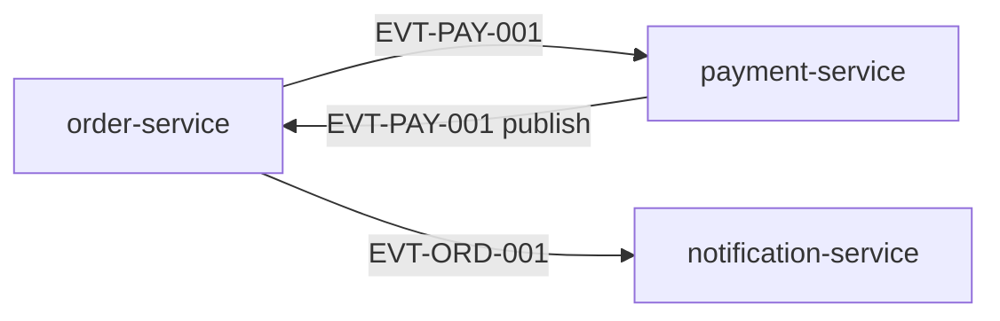

# Ecosystem Index

Entry point for traversing the sample application ecosystem.

## Applications

| Application | Entry point | Exports |
|-------------|-------------|---------|
| order-service | [entry-point.md](./order-service/docs/architecture/entry-point.md) | [exports.md](./order-service/docs/architecture/interfaces/exports.md) |
| payment-service | [entry-point.md](./payment-service/docs/architecture/entry-point.md) | [exports.md](./payment-service/docs/architecture/interfaces/exports.md) |
| notification-service | [entry-point.md](./notification-service/docs/architecture/entry-point.md) | [exports.md](./notification-service/docs/architecture/interfaces/exports.md) |

## Dependency graph

## Cross-service traces

- Order consumes payment: [order imports](./order-service/docs/architecture/interfaces/imports.md) → [payment exports](./payment-service/docs/architecture/interfaces/exports.md)
- Order triggers notification: [order runtime](./order-service/docs/architecture/arc42/runtime.md) → [notification exports](./notification-service/docs/architecture/interfaces/exports.md)
