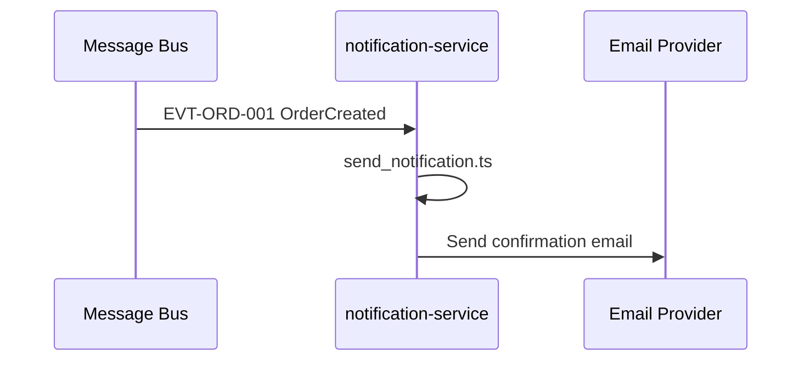

# Runtime View — notification-service

## UC-01: Order Confirmation Notification

## Source mapping

| Step | File |
|------|------|
| Handle event, send notification | [send_notification.ts](../../../src/send_notification.ts) |
| Event publisher (upstream) | [publish_order_created.ts](../../../../order-service/src/publish_order_created.ts) |
