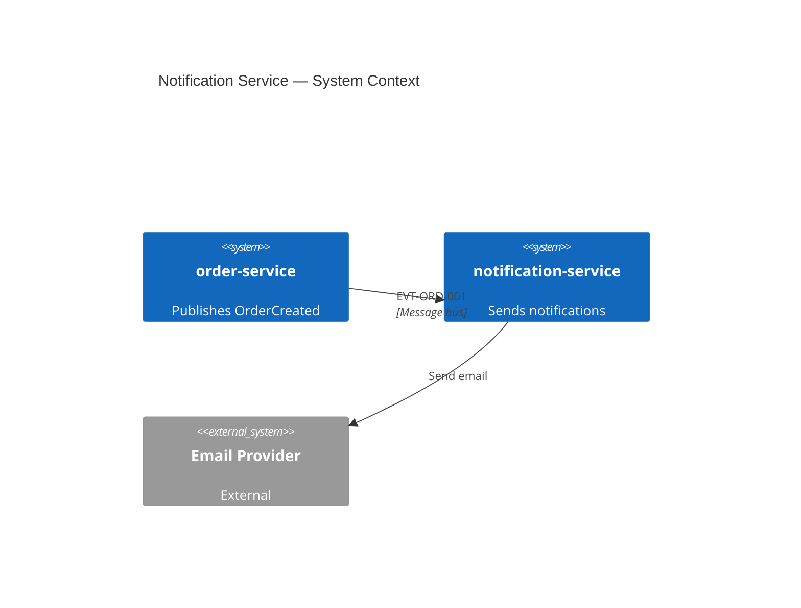

# notification-service — Architecture Entry Point

Sends customer notifications triggered by domain events.

## Purpose

Consumes [EVT-ORD-001](../../../order-service/docs/architecture/interfaces/exports.md#evt-ord-001-ordercreated) from order-service and delivers email/SMS notifications.

## System context

## Navigation

| Section | File |
|---------|------|
| Exports | [interfaces/exports.md](./interfaces/exports.md) |
| Imports | [interfaces/imports.md](./interfaces/imports.md) |
| Runtime | [arc42/runtime.md](./arc42/runtime.md) |
| Ecosystem | [ecosystem-index.md](../../../ecosystem-index.md) |

## Source code

| Component | Source |
|-----------|--------|
| Send notification | [send_notification.ts](../../src/send_notification.ts) |
