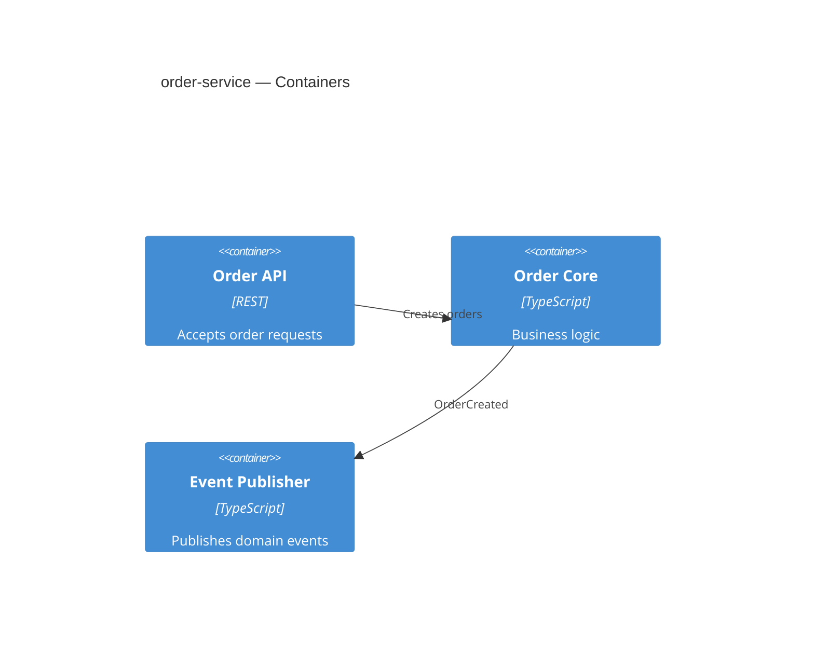

# Building Block View

## Level 2 — Containers

## Level 3 — Components

| Component | Responsibility | Source |
|-----------|----------------|--------|
| OrderCreator | Creates orders, calls payment | [create_order.ts](../../../src/create_order.ts) |
| OrderEventPublisher | Publishes EVT-ORD-001 | [publish_order_created.ts](../../../src/publish_order_created.ts) |

## External dependencies

| Dependency | Interface | Link |
|------------|-----------|------|
| payment-service | API-PAY-001 | [imports.md](../interfaces/imports.md) |
| notification-service | EVT-ORD-001 (consumer) | [exports.md](../interfaces/exports.md) |

### ⚠ Architecture notes

- OrderCreator calls payment client directly without circuit breaker — consider resilience pattern for production (see [risks.md](./risks.md))
