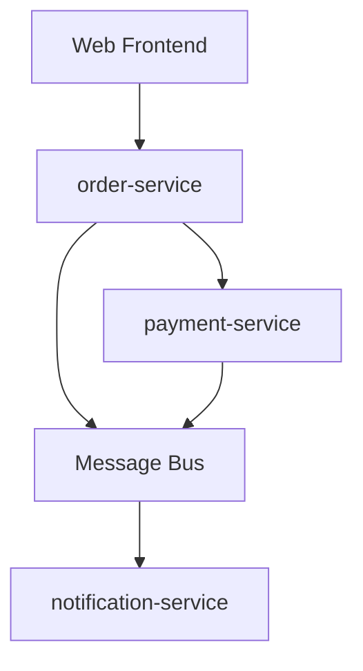

# Context and Scope

## Business context

Customers place orders through a web frontend (out of scope). The order service validates and persists orders, then coordinates downstream services.

## Technical context

## In scope

- Order creation and status tracking
- Payment orchestration (delegate, not implement)
- Publishing OrderCreated events

## Out of scope

- Payment processing logic → [payment-service](../../../../payment-service/docs/architecture/entry-point.md)
- Notification delivery → [notification-service](../../../../notification-service/docs/architecture/entry-point.md)
- Inventory management

## Interface summary

- **Exports:** [exports.md](../interfaces/exports.md)
- **Imports:** [imports.md](../interfaces/imports.md)
