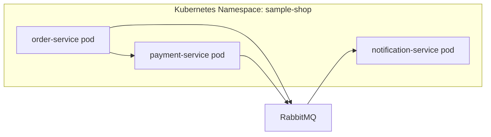

# Deployment View

## Sample deployment (development)

## Infrastructure mapping

| Service | Port | Replicas |
|---------|------|----------|
| order-service | 3001 | 1 |
| payment-service | 3002 | 1 |
| notification-service | 3003 | 1 |

This is illustrative — the sample app contains source and documentation only, no deployment manifests.
