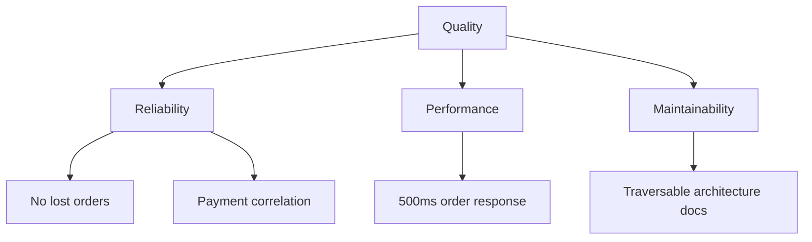

# Quality Requirements

## Quality tree

## Scenarios

| ID | Scenario | Measure |
|----|----------|---------|
| QS-01 | Order created under normal load | p95 < 500ms |
| QS-02 | Payment service unavailable | Order marked failed, no orphan charges |
| QS-03 | Agent traces payment connection | Full path in < 5 link hops |
