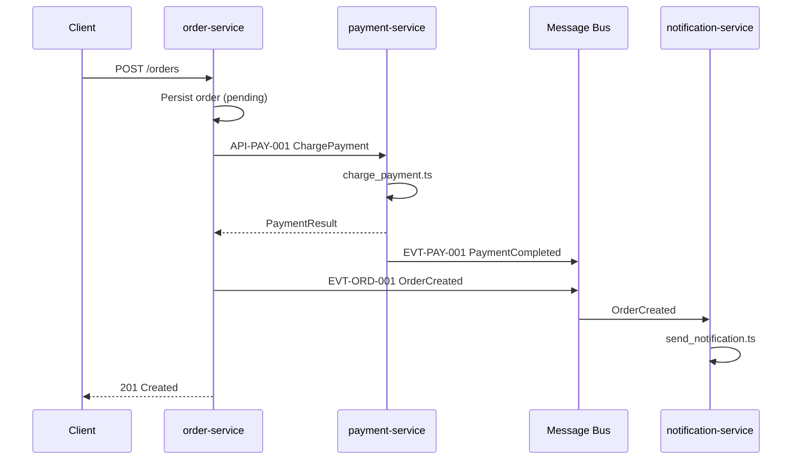

# Runtime View

## UC-01: Create Order

## Source mapping

| Step | Implementation |
|------|----------------|
| Create order | [create_order.ts](../../../src/create_order.ts) |
| Charge payment | [charge_payment.ts](../../../payment-service/src/charge_payment.ts) |
| Publish OrderCreated | [publish_order_created.ts](../../../src/publish_order_created.ts) |
| Send notification | [send_notification.ts](../../../notification-service/src/send_notification.ts) |

### ⚠ Architecture notes

- No idempotency key on order creation — duplicate POST could create duplicate orders
