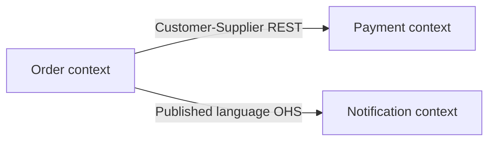

# Context map — order-service ecosystem

Strategic view of bounded contexts in the [sample ecosystem](../../../../ecosystem-index.md).

## Bounded contexts

| Context | Responsibility | Implementation | Language |
|---------|----------------|----------------|----------|
| Order | Order lifecycle, payment coordination | order-service | Order, OrderLine, Placement |
| Payment | Payment capture and settlement | payment-service | Payment, Charge, Settlement |
| Notification | Customer notifications on events | notification-service | Notification, Delivery |

## Context map

| Upstream | Downstream | Pattern | Contract |
|----------|------------|---------|----------|
| Payment | Order | Customer-Supplier | [imports.md](../interfaces/imports.md) API-PAY-001 |
| Order | Notification | Open Host Service | [exports.md](../interfaces/exports.md) EVT-ORD-001 |

## Notes

- Order calls Payment synchronously today — tactical review WRK-002 flagged resilience gap.
- Notification consumes domain events only; no direct Order API.
