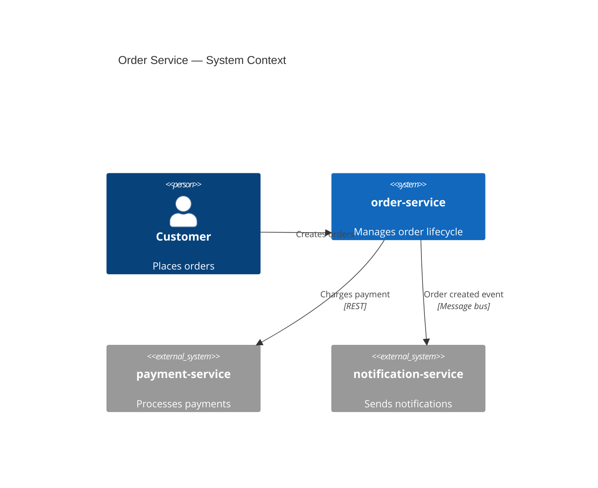

# order-service — Architecture Entry Point

C4 Level 1 context view for the order service in the sample ecosystem.

## Purpose

The order service accepts customer orders, coordinates payment through [payment-service](../../../payment-service/docs/architecture/entry-point.md), and triggers notifications via [notification-service](../../../notification-service/docs/architecture/entry-point.md).

## System context

## Navigation

| Section | File |
|---------|------|
| Blueprint (progress) | [blueprint.md](./blueprint.md) |
| Base context | [context/always-on.md](./context/always-on.md) |
| Interface exports | [interfaces/exports.md](./interfaces/exports.md) |
| Interface imports | [interfaces/imports.md](./interfaces/imports.md) |
| Introduction | [arc42/introduction.md](./arc42/introduction.md) |
| Building blocks | [arc42/building-blocks.md](./arc42/building-blocks.md) |
| Runtime | [arc42/runtime.md](./arc42/runtime.md) |
| Decisions | [arc42/decisions/001-async-messaging.md](./arc42/decisions/001-async-messaging.md) |
| Architecture Work | [work/README.md](./work/README.md) |
| Operations | [ops/troubleshooting.md](./ops/troubleshooting.md) · [ops/pitfalls.md](./ops/pitfalls.md) |
| Ecosystem index | [ecosystem-index.md](../../../ecosystem-index.md) |

## Source code

| Component | Source |
|-----------|--------|
| Order creation | [create_order.ts](../../src/create_order.ts) |
| Event publishing | [publish_order_created.ts](../../src/publish_order_created.ts) |
