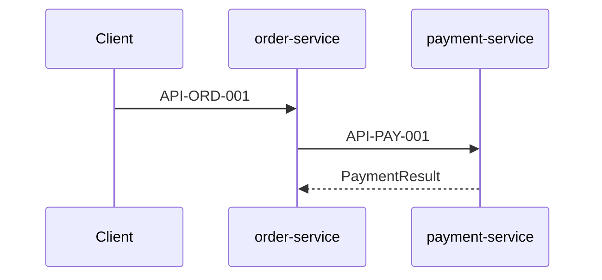

# WRK-001: Payment path when customer places order

| Field | Value |
|-------|-------|
| **ID** | WRK-001 |
| **Type** | question |
| **Status** | reviewed |
| **Date** | 2026-05-10 |
| **Author** | sample (Architecture Work) |

## Question / Goal

How does order-service connect to payment-service when a customer places an order?

## Context

- [entry-point.md](../entry-point.md) — system context
- [runtime.md](../arc42/runtime.md) — UC-01 Create Order sequence
- [imports.md](../interfaces/imports.md) — API-PAY-001, EVT-PAY-001

## Findings / Answer / Design

When a customer places an order, order-service:

1. Accepts `POST /orders` (API-ORD-001) via [create_order.ts](../../../src/create_order.ts)
2. Calls payment-service **synchronously** via API-PAY-001 ([charge_payment.ts](../../../../payment-service/src/charge_payment.ts))
3. On success, payment-service publishes EVT-PAY-001; order-service may consume it per [imports.md](../interfaces/imports.md)
4. order-service publishes EVT-ORD-001 for notification-service (async)

The connection is **REST (synchronous)** at order creation time, not message-bus for the charge itself.

## Recommendations

None for this query — documentation trace only.

## Traceability

| Claim | Source |
|-------|--------|
| Create order entry point | [create_order.ts](../../../src/create_order.ts) |
| Charge via API-PAY-001 | [imports.md](../interfaces/imports.md), [payment exports](../../../../payment-service/docs/architecture/interfaces/exports.md#api-pay-001-charge-payment) |
| Full sequence | [runtime.md](../arc42/runtime.md) |
