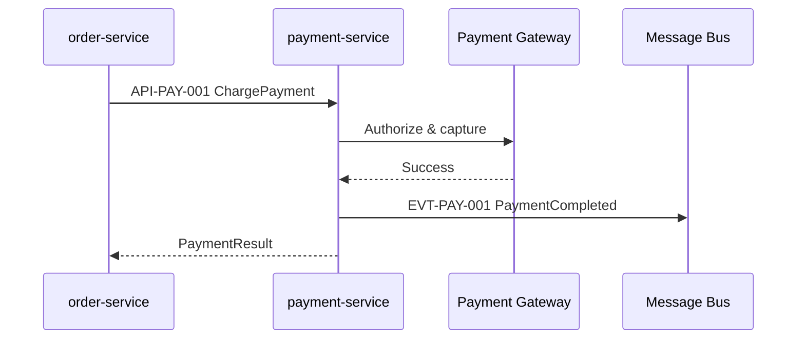

# Runtime View — payment-service

## UC-01: Charge Payment

## Source mapping

| Step | File |
|------|------|
| Process charge | [charge_payment.ts](../../../src/charge_payment.ts) |
| Publish event | [publish_payment_completed.ts](../../../src/publish_payment_completed.ts) |
