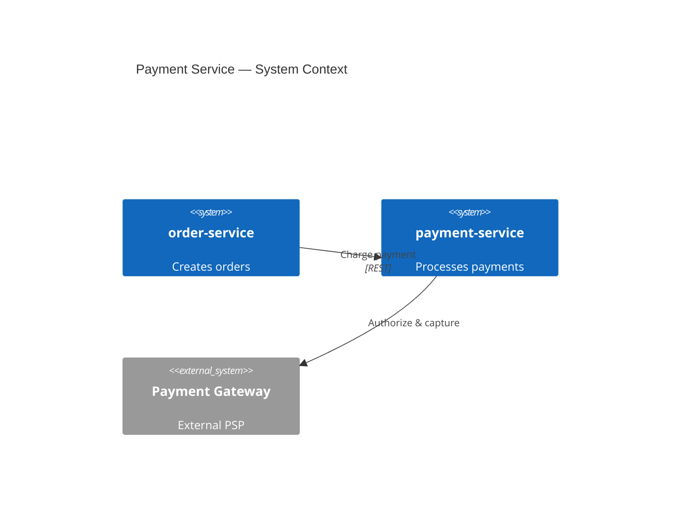

# payment-service — Architecture Entry Point

Processes payments for orders in the sample ecosystem.

## Purpose

Accepts charge requests from [order-service](../../../order-service/docs/architecture/entry-point.md), executes payment, and publishes PaymentCompleted events.

## System context

## Navigation

| Section | File |
|---------|------|
| Exports | [interfaces/exports.md](./interfaces/exports.md) |
| Imports | [interfaces/imports.md](./interfaces/imports.md) |
| Runtime | [arc42/runtime.md](./arc42/runtime.md) |
| Ecosystem | [ecosystem-index.md](../../../ecosystem-index.md) |

## Source code

| Component | Source |
|-----------|--------|
| Charge payment | [charge_payment.ts](../../src/charge_payment.ts) |
| Publish event | [publish_payment_completed.ts](../../src/publish_payment_completed.ts) |
