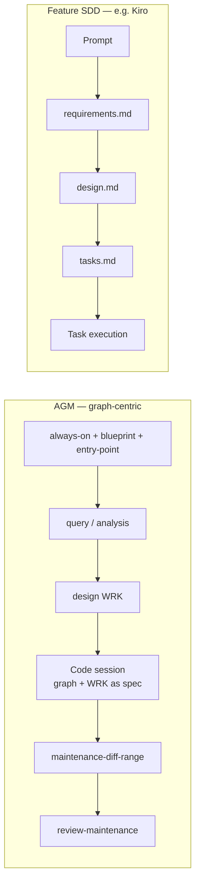

# AGM and spec-driven development

How the Architecture Graph Method (AGM) relates to **spec-driven development** (SDD) — e.g. [Kiro specs](https://kiro.dev/docs/specs/), OpenSpec, or similar *requirements → design → tasks → code* pipelines.

**Audience:** Practitioners who use AGM for implementation, or who compare AGM to feature-spec tools.

---

## Summary

| | **AGM** | **Typical SDD (e.g. Kiro)** |
|---|---------|------------------------------|
| **Primary artifact** | System-wide Markdown **graph** (`docs/architecture/`) | Per-feature **spec folder** (e.g. `.kiro/specs/<feature>/`) |
| **Spec shape** | Distributed: `work/`, arc42, `interfaces/`, ADRs, `blueprint.md` | Centralised: `requirements.md` + `design.md` + `tasks.md` |
| **Thesis** | Architecture documentation is the **API of AI conversation** | Structured specs are the **contract before code** |
| **Planning unit** | WRK work item + graph traversal | Feature or bugfix spec |
| **Task layer** | Recommendations in `work/`; session prompts (informal) | Formal `tasks.md` with status and dependency waves |
| **Code outcome** | Agent sessions in your IDE; **not** a built-in executor | IDE task UI, parallel agents, optional CLI |
| **Validation** | `LINK_CHECK`, Verify workflows, evidence links | Requirements analysis, property-based tests |
| **After shipping** | `maintenance-diff-range` keeps graph in sync | Spec may archive; steering files persist |

**Boundary in one sentence:** AGM is **graph-centric** spec-driven development for **system context and cross-cutting change**; classic SDD is **feature-centric** spec-driven development for **scoped delivery pipelines**.

Both can drive implementation. They differ in **where the spec lives**, **how tasks are formalised**, and **what stays current after merge**.

---

## What the public AGM docs emphasise (and what they omit)

| Source | Current emphasis | Gap |
|--------|------------------|-----|
| [README](../../README.md), [quickstart](../quickstart.md) | Build graph, sync on `git diff`, Verify | Implementation path not on golden path |
| [system-prompt](../../prompts/core/system-prompt.md) | “Architecture scribe”, maintain documentation | “Scribe” ≠ “docs only”; graph is the spec API |
| [Architect article §5–7](../article/blueprint-pattern-for-architects.md) | Agent writes docs; human decides | Design WRK → code → maintenance is valid but implicit |
| [gen-ai-challenges](../gen-ai-challenges.md) | Session discipline, graph integrity | “Spec vs code” mentioned for CI, not SDD comparison |

This reference closes that gap. Adopters who implement via AGM should treat **`work/` + graph** as their spec layer, not a separate tool.

---

## AGM as graph-centric SDD

AGM matches the SDD intent — **think before coding, explicit artefacts, human checkpoints** — with a different topology:

### Spec equivalents

| SDD artefact | AGM equivalent | Notes |
|--------------|----------------|-------|
| Persistent project context (steering) | `always-on.md`, arc42 constraints, `entry-point.md` | Graph + OKF; inclusion by traversal |
| `requirements.md` | `work/` (goal + context), arc42 introduction/quality, domain language | No mandatory EARS; evidence links instead |
| `design.md` | `work/` type `design`, solution strategy, runtime views | Cross-links to `interfaces/`; optional ADR |
| `tasks.md` | **Recommendations** in `work/` + next agent session | No standard task file; use WRK + session prompt |
| Progress tracking | `blueprint.md` WRK register, phase states | Not per-feature task UI |
| Post-merge sync | **`maintenance-diff-range`** (required habit) | SDD tools rarely enforce doc↔code sync |

### Implementation path (practitioner pattern)

Not a separate shipped workflow — the composed habit many teams use:

1. **Prepare context** — Bootstrap / Refinement so the graph is traversable.
2. **Specify** — `architecture-work-design` (or analysis → design) → `work/YYYY-MM-DD-<slug>.md`, WRK in `blueprint.md`.
3. **Implement** — New agent session: read graph + WRK; write code per Recommendations and interface contracts (`exports.md` / `imports.md`).
4. **Sync** — Same PR (or follow-up): `maintenance-diff-range` updates arc42, interfaces, building blocks.
5. **Verify** — Fresh chat: `review-maintenance` (report-only).

Example design with implementation recommendations: [payment circuit breaker WRK](../../examples/sample-app/order-service/docs/architecture/work/2026-05-20-payment-circuit-breaker-design.md).

---

## Clear delineation

### AGM owns

- **System-wide** architecture truth in Git (arc42, C4, ADRs, DDD `domain/`)
- **Cross-service** contracts (`interfaces/exports.md`, `imports.md`)
- **Deterministic retrieval** — link traversal, not embedding search
- **Cross-session state** — `blueprint.md`, session log, WRK register
- **Doc↔code discipline** — maintenance on `git diff`, Verify in fresh chat
- **Design / analysis** with traceability tables and ADR impact

### Feature SDD tools own

- **Per-feature** requirements (`requirements.md`, EARS, user stories)
- **Formal task breakdown** (`tasks.md`, dependencies, parallel execution)
- **Requirements-gap analysis** before design
- **Automated intent validation** (e.g. property-based tests)
- **Cold start** from prompt + codebase without a pre-built graph

### Overlap (choose consciously)

| Concern | AGM | Feature SDD |
|---------|-----|-------------|
| Technical design before code | `architecture-work-design` | `design.md` |
| Mermaid, alternatives, impact | `work/` template | `design.md` |
| Human approval gates | draft → reviewed WRK; Verify | phase approvals in spec UI |
| Agent implementation | IDE agent + graph context | Task runner + spec context |

**Do not duplicate:** A Kiro `design.md` for a large architectural change should **link into** or **feed** an AGM WRK/ADR — not replace the graph.

---

## When to use which

| Situation | Prefer AGM | Prefer feature SDD |
|-----------|------------|-------------------|
| Brownfield, cross-cutting refactor | ✓ | |
| Multi-service integration boundaries | ✓ | |
| Long-lived architecture knowledge | ✓ | |
| New feature, clear product requirements | | ✓ |
| Many small parallel implementation tasks | | ✓ |
| Team needs EARS / acceptance criteria artefact | | ✓ |
| Intent vs code automated checks | | ✓ |
| Graph already maintained | ✓ for implementation too | optional add-on |

**Combined use:** AGM graph as system spec API; feature SDD for isolated features — merge outcomes into the graph via Maintenance.

---

## Terminology

| Term | Meaning in AGM docs |
|------|---------------------|
| **Documentation API** | The linked graph agents read instead of repo dumps |
| **Architecture scribe** | Agent proposes; human approves **decisions** — includes code guided by WRK, not only Markdown |
| **Implementation** (doc area) | arc42 building blocks/runtime + `work/` — structure knowledge, not a task runner |
| **Spec** | In this doc: any explicit pre-code artefact; AGM’s spec is the **graph + WRK**, not a single folder |

---

## Related

| Document | Purpose |
|----------|---------|
| [quickstart.md](../quickstart.md) | Golden path + human responsibilities |
| [article/blueprint-pattern-for-architects.md §7](../article/blueprint-pattern-for-architects.md) | Comparison with RAG and related approaches |
| [extended-workflows.md](./extended-workflows.md) | `architecture-work-*` catalog |
| [blueprint-format.md](./blueprint-format.md) | WRK register schema |
| [maintenance-pipeline.md](./maintenance-pipeline.md) | Post-implementation sync |
