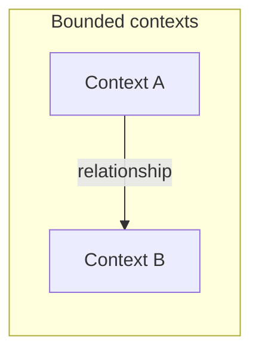

# Context map

<!-- Strategic DDD: bounded contexts and relationships. Maintain via domain-work-context-map or Refinement. -->

## Bounded contexts

| Context | Responsibility | Implementation (module / service) | Language |
|---------|----------------|-----------------------------------|----------|
| — | — | — | — |

## Context map

**Relationship legend:** use DDD integration patterns — Partnership · Customer-Supplier · Conformist · Anti-Corruption Layer · Open Host Service · Shared Kernel · Separate Ways

| Upstream | Downstream | Pattern | Contract |
|----------|------------|---------|----------|
| — | — | — | [interfaces/](../interfaces/) |

## Notes

- Link each context to [exports.md](../interfaces/exports.md) / [imports.md](../interfaces/imports.md) where applicable.
- Team ownership: <!-- optional Conway alignment -->
